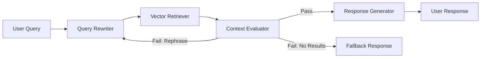

# Privacy-First Semantic File Explorer

> **Codename:** `DeepLens`
> A cross-platform desktop application that replaces filename-based lookups with deep, multi-modal semantic search — entirely offline or cloud-accelerated.

---

## 1. Product Vision & Overview

Users can register local directories (e.g., `~/Documents`, `~/Images`, `~/Videos`). The system indexes files **locally and asynchronously**, building a rich vector index over text, images, audio, and video content. Users then run intuitive, conversational queries across all modalities — **entirely offline** in Local Mode, or leveraging cloud APIs in Cloud Mode.

### Core Differentiators

| Differentiator | Why It Matters |
|---|---|
| **Privacy-first** | All data stays on-device in Local Mode; no telemetry, no cloud calls |
| **Multi-modal** | Unified search across documents, images, audio, and video |
| **Swappable backends** | Single config flag switches between local and cloud stacks |
| **Agentic RAG** | LangGraph state machine with retry loops, not a static chain |
| **MCP-native** | Exposes retrieval as standard tools for Cursor / Claude Desktop |

---

## 2. Target Technical Architectures

The application core follows a **Repository & Factory Design Pattern**. The entire backend engine is hot-swapped via a single configuration flag (`CURRENT_MODE`).

### Mode A: Local Privacy Mode (CPU-friendly)

| Layer | Technology |
|---|---|
| Vector Store | **LanceDB** (embedded, disk-based, negligible RAM) |
| Embedding Encoder | **Jina-CLIP-v2** (<1B params; efficient on consumer CPUs, multilingual) |
| Text Chat / Rewriter | **Llama-3.2-3B** or **Phi-4-mini** via **Ollama** |
| Audio Transcription | **faster-whisper** (INT8 quantized, CPU mode) |
| Document Parsing | **Docling** (RT-DETR layout + Granite-Docling, local) |

### Mode B: Cloud / CV Showcase Mode

| Layer | Technology |
|---|---|
| Vector Store | **PostgreSQL + pgvector** (bundled portable instance or remote) |
| Embedding & VLM | **Gemini Embedding 004** & **Gemini 2.5 Flash** (AI Studio free tier) |
| Text Chat / Rewriter | **Gemini 2.5 Flash** |
| Audio Transcription | **Gemini 2.5 Flash** (native audio understanding) |
| Document Parsing | **Docling** (same as local — consistent parsing layer) |

### Mode Selection

```python
# config.py
class AppMode(str, Enum):
    LOCAL = "local"
    CLOUD = "cloud"

CURRENT_MODE: AppMode = AppMode.LOCAL  # Single flag to swap everything
```

---

## 3. Layered Architecture

```
┌─────────────────────────────────────────────────────────┐
│                    Presentation Layer                    │
│          PySide6 / Qt6 Desktop GUI + System Tray        │
├─────────────────────────────────────────────────────────┤
│                    Application Layer                     │
│    LangGraph Orchestrator  ·  MCP Server  ·  CLI        │
├─────────────────────────────────────────────────────────┤
│                     Service Layer                        │
│  Ingestion Pipeline  ·  Query Pipeline  ·  File Watcher │
├─────────────────────────────────────────────────────────┤
│                    Repository Layer                      │
│  DocumentRepository (ABC)                                │
│  ├─ LanceDBRepository    (Mode A)                       │
│  └─ PgVectorRepository   (Mode B)                       │
├─────────────────────────────────────────────────────────┤
│                     Engine Layer                         │
│  EmbeddingEngine (ABC)  ·  ChatEngine (ABC)             │
│  ├─ JinaClipEngine      ├─ OllamaEngine                │
│  └─ GeminiEmbedEngine   └─ GeminiChatEngine             │
├─────────────────────────────────────────────────────────┤
│                   Infrastructure                         │
│  Config  ·  Logging  ·  Encryption  ·  Task Queue       │
└─────────────────────────────────────────────────────────┘
```

---

## 4. Data Processing & Architectural Pipeline

```
[ User Action: Register Folder / Drop File / Ask Query ]
               │
               ▼
  ┌─────────────────────────────┐
  │  Core Application Controller│ ◄── Factory loads chosen Backend
  └──────────┬──────────────────┘
             │
     ┌───────┴────────┐
     ▼                ▼
 INGESTION        SEARCH
 (Async)          (Sync)
     │                │
     ▼                ▼
 ┌────────┐    ┌──────────────┐
 │Unzip & │    │Query Rewriter│ ← Strips filler, emits keywords
 │Route   │    └──────┬───────┘
 └───┬────┘           │
     │                ▼
     ▼         ┌──────────────┐
 ┌────────┐    │Vector Embed  │ ← Encodes query into vector
 │Chunk & │    └──────┬───────┘
 │Extract │           │
 └───┬────┘           ▼
     │         ┌──────────────┐
     ▼         │Vector DB     │ ← Cosine similarity + metadata filter
 ┌────────┐    │Lookup        │
 │DB      │    └──────┬───────┘
 │Ingest  │           │
 └───┬────┘           ▼
     │         ┌──────────────┐
     │         │Context       │ ← Quality gate: retry if poor
     │         │Evaluator     │
     │         └──────┬───────┘
     │                │
     │                ▼
     └──────► ┌──────────────┐
              │Generative    │ ← LLM synthesizes answer
              │Response      │
              └──────────────┘
```

---

## 5. Key Functional Requirements

### F-1: File Pre-processing & Extraction

- Accept `.zip`, `.rar`, `.7z`, and `.tar.gz` archives.
- Extract to a **sandboxed** `tempfile` directory with strict path-traversal validation (reject entries with `..` or absolute paths — Zip Slip protection).
- Route sub-files by extension, process each, then **securely purge** temporary files immediately after vector generation.
- Maintain an extraction manifest log for audit.

### F-2: Multi-Modal Ingestion

#### Documents (via Docling)

- **Layout Analysis**: Process headlessly using Docling's RT-DETR layout engine and Granite-Docling models. Maps sections, headers, multi-column reading orders, and tables into clean Markdown.
- **Chunking Strategy**: Structure-aware overlapping chunks (~500 words, 10–20% overlap). Chunk boundaries respect document hierarchy — tables, lists, and code blocks are never split mid-element.
- **Supported formats**: `.pdf`, `.docx`, `.pptx`, `.xlsx`, `.html`, `.md`, `.txt`, `.csv`, `.json`, `.xml`, `.epub`, `.rtf`

#### Images

- Encoded into **1 vector per image** using the active embedding engine.
- Extract EXIF metadata (GPS, camera, timestamp) into searchable metadata fields.
- **Supported formats**: `.jpg`, `.png`, `.webp`, `.bmp`, `.gif`, `.tiff`, `.svg` (rasterized)

#### Audio Files *(New — not in original PRD)*

- **Local Mode**: Transcribe via `faster-whisper` (INT8 CPU). Extract timestamped segments. Store transcript chunks + metadata vectors.
- **Cloud Mode**: Send to Gemini for native audio understanding + transcript extraction.
- **Supported formats**: `.mp3`, `.wav`, `.flac`, `.ogg`, `.m4a`, `.aac`

#### Video — Cloud Mode (Gemini)

- Use `ffmpeg` to clip into **15–30 second chunks** with **10-second overlap** (accommodates Gemini's upload limits).
- Send video chunks to Gemini for native multi-modal embedding (visual + audio jointly).
- Extract and store any embedded subtitle tracks (`.srt`/`.vtt`).

#### Video — Local Mode (Decoupled A/V Pipeline)

Processed **headlessly** inside async background workers:

1. **Visual**: OpenCV samples frames at 1 FPS → Jina-CLIP-v2 encodes each frame → visual vector index.
2. **Audio**: `ffmpeg` extracts raw `.wav` track → `faster-whisper` (INT8 CPU) transcribes with timestamps → text vector index.
3. **Subtitles**: If `.srt`/`.vtt` tracks exist in container, extract and index separately with timestamp alignment.
4. **Timestamp Alignment**: Sentence-level start/end timestamps stored in metadata for GUI timeline navigation.
5. **Cleanup**: Temporary `.wav` and frame files purged immediately after inference.

### F-3: Subtitle & Caption Support *(New)*

- Standalone `.srt` and `.vtt` files are indexed with timestamp metadata.
- Embedded subtitle tracks in video containers (`.mkv`, `.mp4`) are auto-extracted via `ffmpeg`.
- Subtitles are chunked by timestamp windows and stored with parent video path linkage.

### F-4: Database Schema & Metadata

Every stored vector row carries:

```python
@dataclass
class VectorRecord:
    id: str                    # UUID
    vector: list[float]        # 1024-dim (local) or 3072-dim (cloud)
    content: str               # Raw text chunk or image description
    absolute_path: str         # Full system path to source file
    filename: str              # Basename
    parent_directory: str      # Parent folder path
    file_type: str             # Extension category: doc/image/audio/video
    mime_type: str             # Exact MIME type
    chunk_index: int           # Position within source file
    total_chunks: int          # Total chunks from source file
    timestamp_start: float | None  # For A/V: start time in seconds
    timestamp_end: float | None    # For A/V: end time in seconds
    created_at: datetime       # Ingestion timestamp
    file_modified_at: datetime # Source file's last modified time
    file_hash: str             # SHA-256 of source file (dedup)
    metadata_json: str         # Extensible JSON blob (EXIF, etc.)
```

- Metadata fields indexed for **scoped filtering** (search within a selected folder subtree in the GUI).
- Dynamic vector dimensions: 1024 (local) vs. 3072 (cloud).
- **Deduplication**: Files with matching `file_hash` skip re-ingestion unless `file_modified_at` has changed.

### F-5: Conversational Query Pre-processing

- A **query-rewriter** instruction loop intercepts input text.
- Strips conversational filler ("please", "thank you", "can you look for").
- Isolates core semantic targets before vector encoding.
- Supports **multi-turn context**: the rewriter considers the last N turns of conversation history for pronoun resolution and topic continuity.

### F-6: Agentic RAG via LangGraph



**Nodes:**
| Node | Responsibility |
|---|---|
| `Query_Rewriter` | Strips noise, extracts keywords, handles multi-turn context |
| `Vector_Retriever` | Embeds query, runs ANN search with metadata filters |
| `Context_Evaluator` | Scores relevance; gates passage to generator or retries |
| `Response_Generator` | LLM synthesizes human-readable answer with source citations |
| `Fallback_Handler` | Graceful "no results" response with search suggestions |

**Edges:**
- `Evaluator → Rewriter`: Conditional loop if retrieval scores below threshold (max 2 retries).
- `Evaluator → Fallback`: If all retries exhausted.
- All state transitions logged for observability (LangSmith in Cloud Mode).

### F-7: Model Context Protocol (MCP) Server

- Built on the official **Python MCP SDK** (`mcp` package).
- **Exposed Tools:**
  - `semantic_search(query, folder_filter?, file_type_filter?, top_k?)` — Run vector search
  - `list_indexed_folders()` — Return all registered directories
  - `get_file_chunks(file_path)` — Return all chunks for a specific file
  - `get_indexing_status()` — Return progress of current indexing jobs
- **Transport**: `Stdio` for local interop with Cursor, Claude Desktop, VS Code, etc.
- **Security**: Tools only expose read access; no file writes or deletions via MCP.

### F-8: File Watcher & Incremental Indexing *(New)*

- Use `watchdog` (Python) to monitor registered directories for file changes.
- **Events handled**: Created, Modified, Deleted, Moved.
- On modification: re-hash → compare → re-ingest only if content changed.
- On deletion: mark vectors as stale; optionally purge on next compaction.
- Debounce rapid changes (500ms window) to avoid redundant processing.

---

## 6. GUI Specification

### Technology

- **Framework**: PySide6 (Qt6) — cross-platform, native look, GPU-accelerated rendering.
- **Theming**: Dark mode (default) + Light mode toggle. Custom Qt stylesheet with modern aesthetics (rounded corners, subtle shadows, accent colors).

### Layout (3-Panel)

```
┌──────────────┬──────────────────────────────┬──────────────┐
│              │                              │              │
│  Folder      │     Chat / Results           │   Preview    │
│  Tree        │     Panel                    │   Panel      │
│              │                              │              │
│  • Registered│  ┌────────────────────────┐  │  • File      │
│    folders   │  │ Query input bar        │  │    preview   │
│  • File      │  ├────────────────────────┤  │  • Image     │
│    browser   │  │ Conversation history   │  │    viewer    │
│  • Checkbox  │  │ with source cards      │  │  • Video     │
│    scope     │  │                        │  │    player    │
│    filter    │  │ Each result shows:     │  │    w/ seek   │
│              │  │  - Relevance score     │  │  • Document  │
│  ─────────── │  │  - File path (link)    │  │    renderer  │
│  Indexing    │  │  - Content snippet     │  │              │
│  Progress    │  │  - Thumbnail           │  │  • Metadata  │
│  Bar         │  └────────────────────────┘  │    panel     │
│              │                              │              │
└──────────────┴──────────────────────────────┴──────────────┘
                        ┌─────────┐
                        │ Status  │  System tray icon
                        │ Bar     │  with indexing status
                        └─────────┘
```

### Key UI Features

- **Drag & Drop**: Drop folders or files directly onto the app to register/ingest.
- **Indexing Progress**: Per-folder progress bars with ETA, file count, and error indicators.
- **Scoped Search**: Checkbox tree to limit search to specific folders or file types.
- **Result Cards**: Each search result shows relevance score, source file link (clickable to open in OS), content snippet, and thumbnail.
- **Video Timeline**: For video results, show a seekable timeline with highlighted matching segments.
- **Keyboard Shortcuts**: `Ctrl+K` for quick search, `Ctrl+,` for settings, `Esc` to close panels.
- **Accessibility**: Full keyboard navigation, screen reader labels, high-contrast mode option.

---

## 7. Security & Privacy

| Concern | Mitigation |
|---|---|
| **Data at rest** | Vectors stored locally; no cloud sync in Local Mode |
| **API keys** | Encrypted via OS keyring (`keyring` Python package) — never plaintext in config |
| **Archive extraction** | Sandboxed tempdir with Zip Slip protection (reject `..` and absolute paths) |
| **Path traversal** | All user-supplied paths canonicalized and validated against registered roots |
| **MCP access** | Read-only tools; no write/delete operations exposed |
| **Network isolation** | Local Mode makes zero network calls; verified via firewall rules in CI |
| **Dependency security** | `pip-audit` in CI pipeline; pinned dependencies with hash verification |

---

## 8. Project Structure

```
multi_modal_rag/
├── src/
│   └── deeplens/
│       ├── __init__.py
│       ├── main.py                  # Application entry point
│       ├── config.py                # AppMode, settings, paths
│       │
│       ├── core/                    # Core abstractions
│       │   ├── repository.py        # DocumentRepository ABC
│       │   ├── embedding.py         # EmbeddingEngine ABC
│       │   ├── chat.py              # ChatEngine ABC
│       │   ├── factory.py           # BackendFactory (creates repos/engines by mode)
│       │   └── models.py            # VectorRecord, SearchResult dataclasses
│       │
│       ├── repositories/            # Concrete repository implementations
│       │   ├── lancedb_repo.py
│       │   └── pgvector_repo.py
│       │
│       ├── engines/                 # Concrete engine implementations
│       │   ├── jina_clip.py
│       │   ├── gemini_embed.py
│       │   ├── ollama_chat.py
│       │   └── gemini_chat.py
│       │
│       ├── ingestion/               # File processing pipeline
│       │   ├── watcher.py           # File system watcher (watchdog)
│       │   ├── extractor.py         # Archive extraction (zip/rar/7z)
│       │   ├── router.py            # Routes files by type
│       │   ├── chunkers/
│       │   │   ├── document.py      # Docling-based document chunking
│       │   │   ├── image.py         # Image processing + EXIF
│       │   │   ├── audio.py         # Audio transcription chunking
│       │   │   ├── video.py         # Video A/V decoupled processing
│       │   │   └── subtitle.py      # SRT/VTT parsing
│       │   └── task_queue.py        # Async ingestion job queue
│       │
│       ├── search/                  # Query pipeline
│       │   ├── graph.py             # LangGraph state machine
│       │   ├── rewriter.py          # Query rewriter node
│       │   ├── retriever.py         # Vector retriever node
│       │   ├── evaluator.py         # Context evaluator node
│       │   └── generator.py         # Response generator node
│       │
│       ├── mcp/                     # MCP server
│       │   ├── server.py            # MCP tool definitions
│       │   └── transport.py         # Stdio transport setup
│       │
│       └── gui/                     # PySide6 UI
│           ├── app.py               # QApplication setup
│           ├── main_window.py       # 3-panel layout
│           ├── widgets/
│           │   ├── folder_tree.py   # Left panel: folder browser
│           │   ├── chat_panel.py    # Center panel: search + chat
│           │   ├── preview_panel.py # Right panel: file preview
│           │   ├── progress_bar.py  # Indexing progress
│           │   └── settings.py      # Settings dialog
│           ├── themes/
│           │   ├── dark.qss
│           │   └── light.qss
│           └── resources/           # Icons, fonts
│
├── tests/
│   ├── unit/
│   │   ├── test_chunkers.py
│   │   ├── test_repository.py
│   │   ├── test_rewriter.py
│   │   └── test_evaluator.py
│   ├── integration/
│   │   ├── test_ingestion_pipeline.py
│   │   ├── test_search_pipeline.py
│   │   └── test_mcp_server.py
│   └── conftest.py                  # Shared fixtures
│
├── scripts/
│   ├── setup_ollama.sh              # Download & configure Ollama models
│   └── setup_postgres.sh            # Setup portable pgvector instance
│
├── pyproject.toml                   # Project metadata, deps (uv/poetry)
├── Dockerfile                       # Containerized deployment
├── docker-compose.yml               # Full stack: app + postgres
├── Makefile                         # Common commands: lint, test, run
├── .env.example                     # Environment variable template
├── README.md
└── LICENSE
```

---

## 9. Technology Stack & Dependencies

| Category | Package | Version | Purpose |
|---|---|---|---|
| **GUI** | PySide6 | ≥6.7 | Cross-platform desktop UI |
| **Vector DB (Local)** | lancedb | ≥0.15 | Embedded vector store |
| **Vector DB (Cloud)** | pgvector | ≥0.3 | PostgreSQL vector extension |
| **DB Driver** | asyncpg | ≥0.30 | Async PostgreSQL client |
| **Embeddings (Local)** | transformers + jina-clip-v2 | — | Multi-modal encoder |
| **Embeddings (Cloud)** | google-genai | ≥1.0 | Gemini API client |
| **Chat (Local)** | ollama | ≥0.4 | Local LLM inference |
| **Orchestration** | langgraph | ≥0.4 | Agentic RAG state machine |
| **MCP** | mcp | ≥1.0 | Model Context Protocol SDK |
| **Document Parsing** | docling | ≥2.0 | Layout-aware doc processing |
| **Transcription** | faster-whisper | ≥1.0 | Local speech-to-text |
| **Video Processing** | opencv-python-headless | ≥4.10 | Frame extraction |
| **Media Utils** | ffmpeg-python | ≥0.2 | Audio/video manipulation |
| **File Watching** | watchdog | ≥4.0 | Filesystem event monitoring |
| **Archive Handling** | py7zr, rarfile | — | 7z and RAR extraction |
| **Security** | keyring | ≥25 | OS-level secret storage |
| **Testing** | pytest, pytest-asyncio | — | Test framework |
| **Linting** | ruff | ≥0.8 | Fast Python linter |
| **Type Checking** | mypy | ≥1.13 | Static type analysis |

---

## 10. Non-Functional Requirements

### Performance

| Metric | Target |
|---|---|
| Query-to-response latency (local) | < 3 seconds for 10K indexed files |
| Query-to-response latency (cloud) | < 5 seconds (network-bound) |
| Ingestion throughput | ≥ 50 documents/minute on 4-core CPU |
| GUI responsiveness | Main thread never blocked > 100ms |
| Memory (idle) | < 200 MB RAM |
| Memory (during ingestion) | < 1.5 GB RAM |

### Quantization & Storage

- Auto-enable **INT8 scalar quantization** in LanceDB to compress vectors to ~1 KB per entry (75% reduction).
- pgvector: Use `halfvec` type for 50% storage reduction in Cloud Mode.

### Async Architecture

- All heavy work (embedding, transcription, DB writes) runs in **background worker threads** via Python `asyncio` + `ThreadPoolExecutor`.
- GUI updates via Qt signal/slot mechanism — never direct cross-thread widget access.
- Ingestion queue with configurable concurrency (default: 2 workers).

### Observability *(CV Showcase)*

- **Local Mode**: Structured JSON logging via `structlog`.
- **Cloud Mode**: Optional **LangSmith** integration for LangGraph trace visualization.
- Ingestion metrics exposed: files processed, errors, queue depth, avg processing time.

---

## 11. Testing Strategy

| Level | Scope | Tools |
|---|---|---|
| **Unit** | Chunkers, rewriter, evaluator, schema validation | pytest, pytest-mock |
| **Integration** | Full ingestion pipeline, search pipeline, MCP server | pytest, testcontainers (pgvector) |
| **E2E** | GUI smoke tests (headless) | pytest-qt |
| **Security** | Zip Slip, path traversal, API key handling | Custom fixtures |
| **CI** | All above + linting + type checking | GitHub Actions |

---

## 12. Deployment & Distribution

### Development

```bash
# Clone and setup
git clone <repo> && cd multi_modal_rag
uv sync                    # Install all deps
cp .env.example .env       # Configure API keys (Cloud Mode only)
make run                   # Launch the app
```

### Docker (Cloud Mode)

```bash
docker-compose up -d       # Starts app + PostgreSQL/pgvector
```

### Desktop Distribution *(Stretch Goal)*

- **PyInstaller** or **Briefcase** to package as standalone `.exe` / `.app` / `.AppImage`.
- System tray integration for background indexing.

---

## 13. Development Phases

### Phase 1: Foundation (Core + Local Mode) ✦
- [ ] Project scaffolding, config system, ABC interfaces
- [ ] LanceDB repository implementation
- [ ] Jina-CLIP-v2 embedding engine
- [ ] Document chunking via Docling
- [ ] Image ingestion (1 vector per image)
- [ ] Basic CLI for testing ingestion + search

### Phase 2: Search Pipeline ✦
- [ ] Ollama chat engine integration
- [ ] LangGraph state machine (Rewriter → Retriever → Evaluator → Generator)
- [ ] Query rewriter with multi-turn context
- [ ] Context evaluator with retry logic

### Phase 3: Audio & Video (Local) ✦
- [ ] Video frame extraction (OpenCV) + Jina-CLIP encoding
- [ ] Audio extraction (ffmpeg) + faster-whisper transcription
- [ ] Subtitle extraction and indexing
- [ ] Timestamp-aligned vector storage

### Phase 4: GUI ✦
- [ ] PySide6 3-panel layout
- [ ] Folder tree with drag-and-drop registration
- [ ] Chat panel with streaming responses
- [ ] Preview panel (documents, images, video player)
- [ ] Indexing progress indicators
- [ ] Dark/Light theme

### Phase 5: Cloud Mode ✦
- [ ] pgvector repository implementation
- [ ] Gemini embedding + chat engine
- [ ] Video chunk upload to Gemini
- [ ] Docker-compose deployment

### Phase 6: MCP & Polish ✦
- [ ] MCP server with Stdio transport
- [ ] File watcher for incremental indexing
- [ ] Archive extraction (zip/rar/7z)
- [ ] Security hardening (keyring, sandboxing)
- [ ] LangSmith observability (Cloud Mode)

### Phase 7: Testing & Distribution ✦
- [ ] Unit + integration + E2E test suites
- [ ] CI/CD pipeline (GitHub Actions)
- [ ] Desktop packaging (PyInstaller/Briefcase)
- [ ] README + demo video for CV

---

## 14. CV Impact Highlights

This project demonstrates mastery across a wide surface area of in-demand technologies:

| Skill | Evidence |
|---|---|
| **System Design** | Repository/Factory pattern, layered architecture, mode-swappable backends |
| **RAG Architecture** | Multi-modal retrieval with agentic retry loops |
| **LangGraph** | Stateful graph orchestration with conditional edges |
| **Vector Databases** | LanceDB (embedded) + pgvector (relational) |
| **Multi-Modal AI** | Jina-CLIP (local) + Gemini VLM (cloud) for text/image/video |
| **MCP** | Production MCP server exposable to industry tools |
| **Desktop Development** | Full PySide6/Qt6 application with native UX |
| **Async Python** | asyncio, ThreadPoolExecutor, signal/slot patterns |
| **DevOps** | Docker, docker-compose, CI/CD, structured logging |
| **Security** | Keyring encryption, sandboxed extraction, path validation |
| **Testing** | Multi-level test strategy with containerized integration tests |
