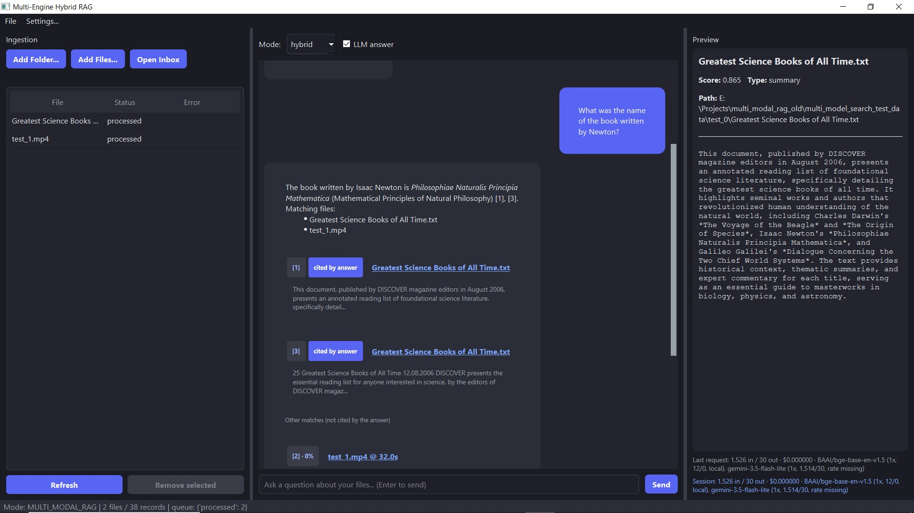

# Multi-Engine Hybrid RAG

<p align="center">
  
</p>

A CPU-friendly, free-tier-first RAG framework that toggles between:

- **DOC_ONLY_RAG** — PostgreSQL + pgvector + native `tsvector` full-text search.
- **MULTI_MODAL_RAG** — embedded LanceDB (documents, audio transcripts, video keyframes).

Retrieval is **summary-aware hybrid**: vector + corpus-wide lexical + per-file summary
rankings fused with Reciprocal Rank Fusion (RRF), with an optional CPU-friendly
cross-encoder re-ranker.

## Requirements & constraints (read first)

- **Python >= 3.11** (3.12 recommended).
- **AVX2 CPU required for LanceDB — the default engine (`MULTI_MODAL_RAG`).** Without AVX2,
  `pylance` aborts with `Illegal instruction` (a native crash, not a catchable Python error).
  On such hosts set `ACTIVE_DB_ENGINE=POSTGRES` (needs Postgres) or `SYSTEM_MODE=DOC_ONLY_RAG`.
- **Engine and content mode are independent.** `ACTIVE_DB_ENGINE` (storage) and `SYSTEM_MODE`
  (content policy) are orthogonal — **Postgres + pgvector can hold multimodal content too**;
  it just needs pgvector installed. LanceDB is the default because it is embedded (no server,
  no Docker). Postgres is only needed when you choose `ACTIVE_DB_ENGINE=POSTGRES`.
- **No API key is required for the default embeddings.** Out of the box,
  `EMBEDDING_PROVIDER=LOCAL` with `BAAI/bge-base-en-v1.5` runs on CPU (downloads once). For
  summaries, cited answers and image/video captions, the **minimum cloud setup is one Google AI
  Studio key** (`VLM_API_KEY` and `LLM_API_KEY`; legacy `GOOGLE_API_KEY` works as a fallback).
  Users with capable hardware can run **everything locally** (Ollama + local embeddings) with
  no cloud key at all.
- **Internet on first run.** Local embeddings, the re-ranker, and Docling/Whisper models are
  downloaded from the Hugging Face Hub the first time they are used.
- **`ffmpeg` is optional** — needed only to extract the audio track from **video** files. The
  desktop app offers to download a static ffmpeg on first launch; otherwise install it on
  `PATH`. Documents and audio-only files work without it.
- **Disk space:** the portable Windows build is ~1.5 GB extracted; models add a few hundred MB.
- **The Windows `.exe` is unsigned** → expect SmartScreen / antivirus warnings.
- **CPU-first, no GPU required** (a GPU is auto-detected for local models if present).
- **The desktop GUI needs a display** (Windows/macOS/X11/Wayland); use the CLIs on headless hosts.
- **Keep `data/` on a local disk** — SQLite WAL + LanceDB dislike network / cloud-synced folders.
- **VLC is optional**, used only for timestamped video playback from the GUI.


## Repository layout

```
.
├── docker-compose.yml        # postgres(+pgvector), pgadmin, and the app image
├── docker/init-pgvector.sql
├── Makefile                  # pg-* and app-* helpers
└── multimodal_rag_core/      # the Python package
    ├── pyproject.toml        # deps + optional extras + console scripts
    ├── requirements.txt      # complete default install (incl. GUI)
    ├── Dockerfile            # multi-stage, includes ffmpeg
    ├── mrag-gui.spec         # PyInstaller spec for the Windows .exe
    └── multimodal_rag/
        ├── config.py         # pydantic settings + APP_ROOT/MRAG_HOME resolution
        ├── query.py          # `mrag-query` CLI (retrieval + cited answer)
        ├── core/             # VectorRecord, SearchResult, FileSearchGroup
        ├── search/           # lexical (BM25), hybrid (RRF), reranker
        ├── database/         # repository ABC + postgres / lancedb providers
        ├── pipeline/         # parsing, embeddings, media, registry
        ├── ingestion/        # durable SQLite queue, watcher, worker, `mrag-ingest`
        ├── gui/              # PySide6 desktop app (`mrag-gui`)
        └── utils/            # api clients, rate limiting, token tracking
```

## Install

Requirements: **Python >= 3.11** and an API key for whichever cloud providers you choose
(embeddings can run locally instead). See **Requirements & constraints** above.

### Option A — pip (full default)
```bash
cd multimodal_rag_core
python -m venv .venv && source .venv/bin/activate   # Windows: .venv\Scripts\activate
pip install -r requirements.txt
pip install -e . --no-deps   # registers the mrag-* commands (requirements.txt holds only third-party deps)
cp .env.example .env        # then edit .env
mrag-ingest status
```

### Option B — pip extras (fine-grained)
```bash
pip install -e ".[lancedb,parsing,video,audio]"     # multimodal
pip install -e ".[postgres,parsing]"                # doc-only
pip install -e ".[all]"                             # everything incl. Docling/torch
```
A bare `pip install -e .` installs only the pure-Python core (queue + API clients),
so `run`/`worker` will report exactly which backend/extra is missing.

### Option C — Docker (most portable)
```bash
# from the repository root
cp multimodal_rag_core/.env.example .env         # compose reads keys from here
MRAG_EXTRAS=parsing docker compose build app      # default image (static ffmpeg)
MRAG_EXTRAS=all     docker compose build app      # full ML image (large)

# document-only, no ffmpeg, smallest image:
MRAG_TARGET=runtime-slim MRAG_EXTRAS=parsing docker compose build app

docker compose run --rm app scan                 # enqueue ./data/inbox
docker compose up -d app                         # watch + process
```
The default image ships a **static ffmpeg** (single binary) and runs as a non-root user.
Measured sizes: `runtime-slim` **328 MB** → static ffmpeg **525 MB** → apt ffmpeg **955 MB**.
All state lives under the mounted `./data` volume (`state.db`, `inbox/`, `processed/`,
`lancedb_lakehouse/`, ...). For doc-only mode, `docker compose up -d postgres` first.
If you want a small image but occasional video, use `runtime-slim` and bind-mount the host
binary: `-v "$(which ffmpeg):/usr/local/bin/ffmpeg:ro"`.

## Configure

Copy `.env.example` to `.env`. Key settings:

| Setting | Purpose |
|---|---|
| `SYSTEM_MODE` | `DOC_ONLY_RAG` or `MULTI_MODAL_RAG` (content policy; suggests a default engine) |
| `ACTIVE_DB_ENGINE` | storage engine; default from `SYSTEM_MODE`, override independently |
| `EMBEDDING_*` | embeddings purpose: provider, model, `EMBEDDINGS_API_KEY`, dimension |
| `VLM_*` | vision purpose: provider, model, `VLM_API_KEY` |
| `LLM_*` | text purpose: provider, model, `LLM_API_KEY` |
| `SEARCH_MODE` | `auto` / `chunk` / `summary` / `hybrid` |
| `MRAG_HOME` | app root for `.env`, `data/`, `state.db` (default `~/.multimodal_rag`, or cwd when a `.env` is present) |

Providers are configured **by purpose** (embeddings / vlm / llm), each with its own provider, model
and key — the single source of truth. Run `mrag-doctor` to see the resolved configuration.

Relative paths resolve against `MRAG_HOME`, not the current working directory.

## Usage

Ingestion:
```bash
mrag-ingest run                 # watch data/inbox/ + process (automatic mode)
mrag-ingest add <file|dir>      # explicit ingest
mrag-ingest scan                # enqueue everything currently in the inbox
mrag-ingest status --failed     # queue stats / failures
mrag-ingest retry all           # requeue failures
mrag-ingest reset-stale         # requeue items stuck in "processing"
mrag-doctor                     # print resolved provider/key/role mapping
```
Query (retrieval + optional cited LLM answer):
```bash
mrag-query "the story about a man who owns a mansion"
mrag-query "mansion" --mode summary --answer
mrag-query "revenue" --folder /data/processed --json
mrag-query -i                    # interactive REPL
```
### Search modes (`SEARCH_MODE`, GUI dropdown, `mrag-query --mode`)

| Mode | What it searches | Reranked? | When to use |
|---|---|---|---|
| `auto` | chunk first; falls back to hybrid when retrieval is empty or the LLM answer abstains | chunk pass: no; hybrid fallback: yes | cheap fast path with a safety net; chat shows which mode answered |
| `hybrid` (default) | chunk + summary vectors + keyword search, fused with RRF | yes (cross-encoder) | best recall; answers cite the fused top hits |
| `summary` | file-level summary vectors only | no | "which files are about X?" |
| `chunk` | passage-level chunk vectors only (pure semantic search) | no | fastest; literal passage lookup |

Desktop GUI (native, Windows/Linux/macOS; not in Docker). Qt Essentials is already included
in `requirements.txt`, so after Option A you can just run it:
```bash
mrag-gui                         # 3-pane window: ingest | chat | preview (+ cited LLM answer)
# if you installed via extras instead: pip install -e ".[gui]"
# optional Windows .exe (build on Windows):
pip install -e ".[gui,build]" && pyinstaller mrag-gui.spec
```
> Automatic ingestion requires `mrag-ingest run` (or the Docker `app` service) to be running.
> Files must be dropped in `data/inbox/`; with no loop active, use `scan`/`add`.

Pipeline handlers are wired in `multimodal_rag/pipeline/registry.py`
(`document`, `audio`, `video`).

### Document parsing (incl. tables)

Documents parse **Docling-first** when it is installed and `DOC_USE_OCR=true`
(GUI: Settings → Document Parsing): layout-aware extraction with tables kept
as Markdown pipe-tables, which chunk cleanly and which answer models read
natively. Otherwise (or for formats Docling doesn't read) lightweight
fallbacks apply (`pypdf` / `python-docx` / `openpyxl`, plain text preserved
without table structure).

Practical notes:

* Use **`.xlsx`, not legacy `.xls`** — Docling reads the former; the latter
  always takes the flat-text fallback.
* Tables survive as *structure*, not computation: lookup questions
  ("who scored highest in physics?") work once indexed, but aggregation
  ("average per subject") stays fragile — RAG retrieves, it doesn't compute.
* Scanned/image-only PDFs need Docling + OCR models (first run downloads a
  few hundred MB); without them such PDFs extract no text.
* `DOC_CHUNK_SIZE` / `DOC_CHUNK_OVERLAP` (words) control passage size; very
  large tables still split across chunks.

## Platform support

> **Currently tested on Windows x64 only.** The code is written to be cross-platform
> (no OS branching in the core; platform-specific bits are isolated), and the Linux/macOS/WSL2
> paths below are expected to work, but they have *not* been run end-to-end yet. Treat them as
> unverified.

| | Linux x64 | macOS | Windows x64 | WSL2 |
|---|---|---|---|---|
| **End-to-end tested** | no | no | **yes** | no |
| Core + APIs + Postgres backend | expected | expected | yes | expected |
| Audio/video (ffmpeg) | expected | expected | yes | expected |
| LanceDB (multimodal) | AVX2 required | AVX2 required | yes (AVX2) | AVX2 required |
| Desktop GUI (`PySide6-Essentials`) | expected | expected | yes | no (no display) |

Notes and caveats:

- **Testing status**: Windows x64 is the only platform exercised so far (CLIs, GUI, ingestion,
  LanceDB, and the packaged `.exe`). Linux/macOS/WSL2 support is best-effort and unverified.
- **AVX2** (runtime limitation, not a design input): `lancedb`/`pylance` crashes with
  `Illegal instruction` on CPUs/VMs without AVX2. Because the engine is decoupled from the
  mode, keep your multimodal content and just set `ACTIVE_DB_ENGINE=POSTGRES` on such hosts.
- **ffmpeg** and **Docker** are system dependencies, not pip-installable.
- **Optional features**: PDF/DOCX/XLSX need `pypdf`/`python-docx`/`openpyxl` (in
  `requirements.txt`); Docling (layout-aware + OCR) and local embeddings/reranker
  (`sentence-transformers`) are optional extras.
- **Storage**: keep `data/` on a local disk; SQLite WAL + LanceDB do not like network
  or cloud-synced filesystems.

## License

MIT
